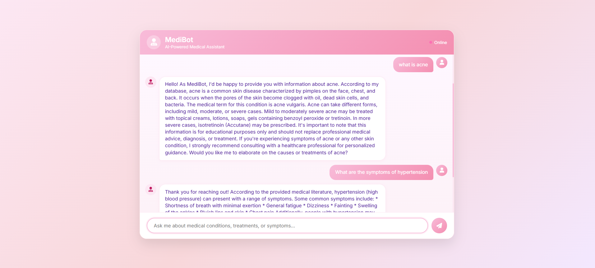

# 🧠 Local Chatbot with Flask + Ollama + LangChain

A stunning, privacy-friendly chatbot interface built using **Flask**, **LangChain**, and **Ollama** running local LLMs **LLaMA3** — with no API keys or internet required.



---

## 🔍 Features

- 🗨️ Modern Chat UI 
- 🧠 Powered by local LLMs (LLaMA3)
- 🪄 Uses LangChain for prompt management
- 🛡️ 100% private and free to use
- 🌐 Built with Flask (Python backend)

---

## 🚀 How to Run Locally

### 1. Install Ollama
[Download Ollama](https://ollama.com/download) for your system (Windows, macOS, Linux)

Then pull a model:
```bash
ollama pull llama3
```
### 2. Clone the Project
```bash
git clone https://github.com/your-username/flask-ollama-chatbot.git
cd flask-ollama-chatbot
```
### 3. Create a Virtual Environment
```bash
python -m venv venv
source venv/bin/activate   # On Windows: venv\Scripts\activate
```
### 4. Install Dependencies
```bash
pip install -r requirements.txt
```
### 5. Run the App
Start Ollama in the background:

```bash
ollama run llama3
```
Then run the Flask app:

```bash
python app.py
```
## 🧰 Tech Stack
- Python 3

- Flask – Lightweight backend framework

- LangChain – Prompt and LLM management

- Ollama – Local LLM serving (LLaMA3)

- HTML/CSS/JS – Frontend chatbot interface
